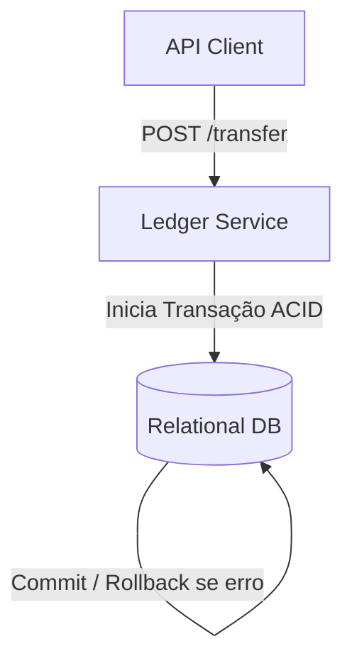

# 🏛️ Dev Senior - Trilha 1 - Etapa 3: System Design - Ledger Consistente Local

* **Responsável:** Staff Software Engineer & Senior Engineer
* **Duração:** 60 minutos
* **Foco:** Atomicidade transacional (ACID), modelagem de dados financeira consistente, concorrência e integridade em banco relacional.

---

## 🎯 O Enunciado do Desafio

Projete a estrutura de dados e o fluxo de backend de um **Serviço de Ledger e Saldo Financeiro** de microsserviço que processa transferências entre usuários e armazena os saldos de forma consistente em um banco de dados relacional clássico (PostgreSQL/MySQL).

* **Throughput:** Pico de **200 transferências de escrita por segundo**.
* **Consistência:** Garantir atomicidade de débito e crédito (dinheiro não pode sumir se uma das operações falhar) e evitar saldos negativos não permitidos.

---

## 🗺️ Guia de Expectativas para Avaliação (Nível Dev Senior)

### 1. Transações ACID e Atomicidade
* **Foco Dev Senior:** O candidato deve propor o uso de transações de banco de dados (`BEGIN TRANSACTION ... COMMIT`) envolvendo os dois lançamentos (débito na conta A e crédito na conta B) para garantir que ambos sucedam ou falhem juntos (Atomicidade).

### 2. Prevenção de Condições de Corrida no Banco (Locks)
* **Desafio:** Se um usuário fizer duas compras paralelas de R$ 50 tendo apenas R$ 60 de saldo, como evitar que ambas sejam aprovadas?
* **Solução Dev Senior:**
  * Uso de bloqueio pessimista no banco relacional (ex.: `SELECT FOR UPDATE` na tabela de saldos no início da transação) para bloquear a linha da conta do remetente, garantindo que a segunda transação paralela aguarde a primeira concluir e recalcular o saldo.

### 3. Modelagem de Dados Imutável (Lançamentos)
* **Foco Dev Senior:** Modelar a tabela `ledger_entries` de forma imutável (apenas inserções, sem updates/deletes no histórico) para garantir auditabilidade.

---

## ⚖️ Rubrica de Avaliação (Dev Senior)
* **Sinal Verde (Green Flag):** Domina comandos SQL de transações e locks (`SELECT FOR UPDATE`); modela tabelas com chaves primárias e estrangeiras corretas; entende integridade transacional de dados.
* **Sinal Vermelho (Red Flag):** Propõe fazer validações de saldo na aplicação sem usar locks no banco, expondo o banco a race conditions gritantes de estouro de saldo.

---

[Ir para a Etapa 4: Coding Onsite ➡️](./04-coding-onsite.md)
