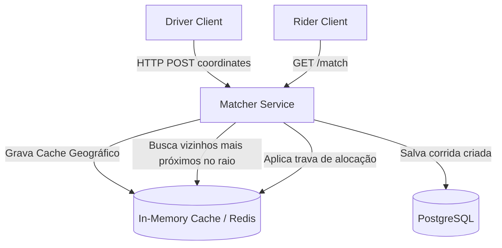

# 🏛️ Dev Senior - Trilha 2 - Etapa 3: System Design - Ride-Sharing Matcher

* **Responsável:** Staff Software Engineer & Senior Engineer
* **Duração:** 60 minutos
* **Foco:** Modelagem de microsserviço local, caching geoespacial na memória e prevenção de race conditions de alocação.

---

## 🎯 O Enunciado do Desafio

Projete a arquitetura do **Microsserviço de Pareamento de Motoristas** para uma cidade de médio porte. O sistema deve coletar a localização GPS dos motoristas (em intervalos de 5s) e expor uma API HTTP `/match` para passageiros buscarem o motorista disponível mais próximo.

* **Escala:** ~1.000 motoristas online, ~100 buscas/segundo.
* **Foco do Sênior:** Modelar a estrutura de caching local, as tabelas de banco relacional e garantir que o mesmo motorista não seja alocado em duas corridas simultâneas.

---

## 🗺️ Guia de Expectativas para Avaliação (Nível Dev Senior)

### 1. Caching Geoespacial Eficiente (Redis)
* **Foco Dev Senior:** O candidato deve evitar consultar o banco de dados principal a cada atualização de geolocalização. Propor o uso de estruturas de dados do Redis (como comandos de localização geográfica GEOADD/GEORADIUS) com expiração rápida das coordenadas (TTL).

### 2. Garantia de Pareamento Único (Locks)
* **Desafio:** Como garantir que o motorista selecionado não receba outra oferta antes de aceitar/rejeitar a atual?
* **Solução Dev Senior:**
  * Uso de transação no banco relacional atualizando o status do motorista de `available` para `matching`, ou criar uma chave temporária bloqueante no Redis (`driver:lock:{id}`) com expiração de 15 segundos (tempo que ele tem para aceitar a corrida).

### 3. Modelagem de Dados de Corridas
* **Foco Dev Senior:** Projetar o schema do banco relacional de forma saudável: tabelas `drivers`, `riders`, `rides` com chaves estrangeiras adequadas, índices e status representados de forma semântica (enums).

---

## ⚖️ Rubrica de Avaliação (Dev Senior)
* **Sinal Verde (Green Flag):** Propõe uso inteligente de caches locais/distribuídos para dados de GPS; descreve detalhadamente o fluxo de transação de banco com locks para alocação exclusiva; projeta tabelas bem normalizadas.
* **Sinal Vermelho (Red Flag):** Não considera concorrência de alocação; projeta tabelas de banco sem chaves primárias ou índices.

---

[Ir para a Etapa 4: Coding Onsite ➡️](./04-coding-onsite.md)
