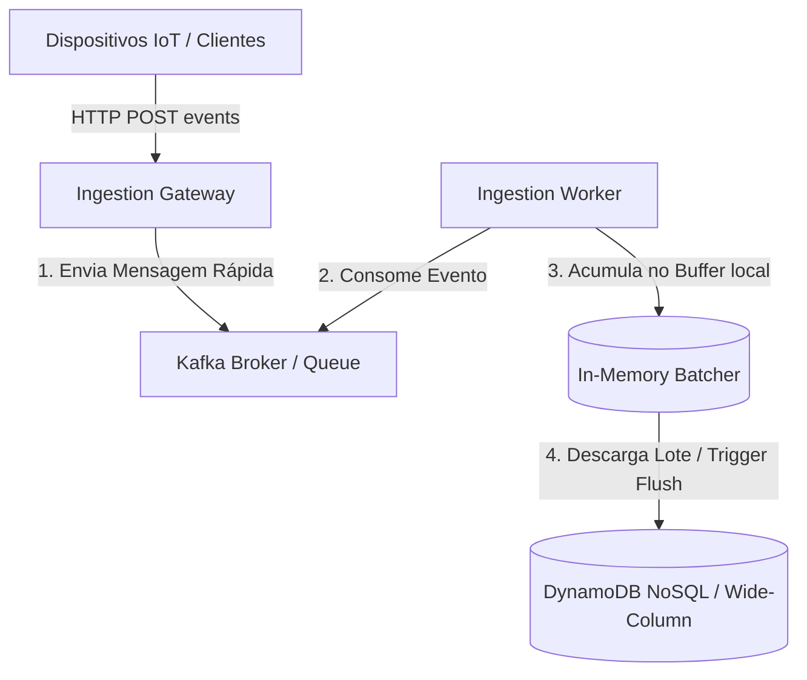

# 🏛️ Dev Senior - Trilha 4 - Etapa 3: System Design - Ingestão de Analytics em Alta Escala

* **Responsável:** Staff Software Engineer & Senior Engineer
* **Duração:** 60 minutos
* **Foco:** Escalabilidade física de escritas, buffering em memória RAM, modelagem NoSQL distribuída e mitigação de hotspots (hot shards).

---

## 🎯 O Enunciado do Desafio

Projete o pipeline de ingestão de cliques de anúncios (Analytics) para a plataforma de AdTech da empresa. O sistema deve coletar dados brutos de eventos de cliques enviados por aplicativos e navegadores ao redor do mundo, validá-los e gravá-los de forma durável para posterior processamento analítico.

* **Throughput:** Suportar picos de gravação de **50.000 eventos por segundo**.
* **Latência de Ingestão:** O cliente (navegador) deve receber uma resposta `202 Accepted` em menos de **20ms**, confirmando que o evento foi aceito para processamento.
* **Foco do Sênior:** Projetar o amortecimento de carga com filas de mensagens, o fluxo de batching em memória RAM local no consumidor/gravador e a seleção de chaves de partição do banco NoSQL distribuído.

---

## 🗺️ Guia de Expectativas para Avaliação (Nível Dev Senior)

### 1. Amortecimento com Filas de Mensagens (Ingestion Buffer)
* **Foco Dev Senior:** O candidato deve propor o desacoplamento imediato do recebimento HTTP da gravação no banco de dados. O Ingestion Gateway apenas recebe o evento, anexa-o a uma fila de mensageria assíncrona (como Apache Kafka ou AWS SQS) e responde ao usuário de forma imediata (`202 Accepted`).
* **Sinal Sênior:** Conhecimento de que a fila protege o banco de dados principal contra picos sazonais de tráfego, redistribuindo e amortecendo a taxa de consumo de escrita.

### 2. Batching Local e Gerenciamento de Memória no Worker
* **Foco Dev Senior:** Os trabalhadores (*Workers*) consomem da fila, mas não gravam registro por registro no NoSQL. Eles devem implementar um buffer em memória que acumula lotes (ex.: de 500 registros ou a cada 2 segundos) para fazer escritas em lote no banco.
* **Desafio:** E se o banco NoSQL ficar lento? A memória do Worker pode explodir (OOM). O candidato sênior deve planejar um limite superior de tamanho do buffer e técnicas de controle de fluxo de leitura da fila (desacelerar o consumo da fila quando a memória estiver cheia - *Backpressure*).

### 3. Modelagem e Particionamento NoSQL (Evitando Hot Shards)
* **Foco Dev Senior:** Modelar os dados em um banco NoSQL estruturado para alta escala de gravação (como DynamoDB ou Cassandra). Escolher a chave de partição (`Partition Key`) de forma inteligente para evitar hot shards.
* **Solução:** Em vez de usar `timestamp` ou `data_dia` (que causariam hotspot), usar `uuid_evento` ou `id_anunciante + hora` composto, garantindo que as partições sejam distribuídas homogeneamente entre os servidores físicos do cluster.

---

## ⚖️ Rubrica de Avaliação (Dev Senior)
* **Sinal Verde (Green Flag):** Sabe dimensionar a taxa de gravação; propõe uso estruturado de filas para descompressão de tráfego; escolhe chaves NoSQL com alta cardinalidade para evitar hotspots; entende as consequências de perdas de dados em buffers locais.
* **Sinal Vermelho (Red Flag):** Propõe gravar diretamente no banco de dados relacional de forma síncrona a cada request HTTP; não entende o conceito de sharding ou como chaves repetitivas travam servidores NoSQL.

---

[Ir para a Etapa 4: Coding Onsite ➡️](./04-coding-onsite.md)
