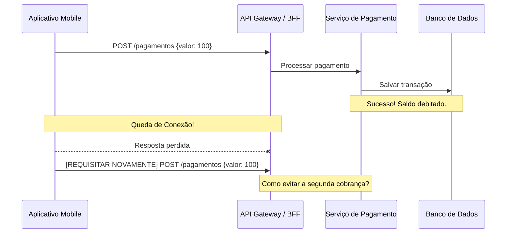

# 🖥️ Etapa 2: Technical Screening (Phone Screen)

* **Responsável:** Staff Software Engineer ou Senior Engineer L5+
* **Duração Recomendada:** 60 minutos
* **Foco:** Fundamentos de engenharia, concorrência, bancos de dados, redes e resolução rápida de problemas de arquitetura.

---

## 🎯 Objetivos do Phone Screen Técnico

Esta etapa valida se o candidato possui a fundação técnica robusta necessária para avançar para as entrevistas presenciais (Onsite Loop). O foco está em **profundidade de conceitos técnicos** e na capacidade de explicar **trade-offs** operacionais em tempo real. 

Procuramos evitar perguntas puramente teóricas de memorização de livros. Buscamos cenários em que o candidato demonstre compreensão de como as decisões de baixo nível afetam o comportamento do sistema sob carga.

---

## ⏱️ Estrutura da Entrevista

1. **Introdução Técnica e Quebra-Gelo** (5 min)
2. **Q&A - Fundamentos de Engenharia** (20 min)
3. **Mini-Desafio de Design: Idempotência de Transações** (30 min)
4. **Perguntas do Candidato e Encerramento** (5 min)

---

## 💬 Q&A - Fundamentos de Engenharia (20 min)

O entrevistador escolhe 3 ou 4 tópicos abaixo para aprofundar, desafiando o candidato com subperguntas caso a resposta inicial seja rasa.

### Tópico A: Concorrência e Programação Assíncrona
* **Pergunta:** "Como você gerencia condições de corrida (*race conditions*) em sistemas altamente concorrentes em nível de processo de aplicação e em nível de banco de dados?"
* **O que avaliar:**
  * Domínio de locks otimistas vs. pessimistas.
  * Mutexes, semáforos, primitivas de concorrência da linguagem de escolha (Goroutines/Channels, Virtual Threads, Async/Await).
  * Impacto de locks no throughput da aplicação.

### Tópico B: Escolha de Banco de Dados e Índices
* **Pergunta:** "Se você precisa projetar um sistema de busca de transações com filtros por múltiplos campos (ex.: valor, data, categoria, status), como abordaria a indexação no Postgres ou MySQL? O que são índices compostos e quais são seus limites?"
* **O que avaliar:**
  * Entendimento de B-Trees e como a ordem das colunas no índice composto afeta o planejamento da query.
  * Consciência do custo de escrita associado à criação de índices excessivos.
  * Quando migrar de um banco relacional para soluções de busca textual (ex.: Elasticsearch/Opensearch).

### Tópico C: Teorema CAP e Consistência em Sistemas Distribuídos
* **Pergunta:** "Em um banco de dados global distribuído geograficamente, o que acontece na prática quando há uma partição de rede (*network partition*)? Como você decide se o seu sistema deve priorizar Consistência (C) ou Disponibilidade (A)?"
* **O que avaliar:**
  * Compreensão prática do Teorema CAP e PACELC.
  * Discussão realista sobre modelos de consistência (Eventual, Strong, Session Consistency).
  * Exemplo prático: sistemas de saldo financeiro devem priorizar consistência (CP), enquanto sistemas de feeds sociais ou carrinhos de compras podem tolerar eventual consistência (AP).

---

## 🛠️ Mini-Desafio de Design: Idempotência de Pagamentos (30 min)

Este é um exercício interativo de lousa ou compartilhamento de tela. O entrevistador desenha o seguinte cenário:

> *"Um aplicativo móvel faz uma requisição HTTP POST para criar um pagamento de R$ 100. A transação é processada com sucesso no backend, mas a conexão de internet do cliente cai logo antes que ele receba a resposta 200 OK. O usuário clica novamente em 'Pagar'. Como garantimos que o usuário não seja cobrado duas vezes?"*

### Habilidades e Soluções Esperadas do Candidato:
1. **Identificação da Chave de Idempotência:** O candidato deve propor o uso de uma chave única gerada no cliente (ex.: UUID v4 anexado no header da requisição, associado a um hash da transação para evitar colisões maliciosas).
2. **Lock Distribuído (Evitar Concorrência Simultânea):** Se o usuário clicar no botão duas vezes muito rápido, duas requisições paralelas podem chegar ao servidor. O candidato deve explicar como implementar um lock distribuído temporário (ex.: Redis com TTL) usando a chave de idempotência para garantir que apenas uma requisição prossiga.
3. **Persistência do Resultado:** O resultado da primeira tentativa deve ser salvo junto com a chave de idempotência. Se uma requisição duplicada com a mesma chave chegar após a conclusão da primeira, o sistema deve retornar imediatamente o resultado salvo, sem reprocessar a cobrança.
4. **Estados Intermediários (In-Flight):** O candidato deve responder o que acontece se a segunda requisição chegar enquanto a primeira ainda está sendo processada (retornar um status específico como `409 Conflict` ou `202 Accepted` indicando processamento em andamento).

---

## ⚖️ Critérios de Avaliação (Rubrica do Entrevistador)

| Avaliação | Indicadores Práticos |
| :--- | :--- |
| **Aprovado com Destaque (Strong Hire)** | Propõe imediatamente a chave de idempotência gerada pelo cliente; descreve cenários de corrida paralelos e propõe locks distribuídos com Redis ou restrições exclusivas de banco de dados; discute falhas parciais (ex.: se o Redis cair, qual o fallback?); explica o Teorema CAP com exemplos do próprio cotidiano profissional. |
| **Aprovado (Hire)** | Entende a necessidade de um ID único; propõe validação de duplicidade em banco de dados; descreve os conceitos de lock distribuído, embora possa precisar de um empurrãozinho para tratar o caso de concorrência paralela exata (double click rápido); conhece os fundamentos de CAP. |
| **Alerta (No Hire - Foco em L5/Senior)** | Propõe apenas soluções frágeis no lado do cliente (desabilitar o botão) ou validações puramente na aplicação sem considerar concorrência distribuída; confunde lock pessimista com otimista ou não sabe justificar a escolha de banco de dados. |

---

[Ir para a Etapa 3: System Design Onsite ➡️](./03-system-design-onsite.md)
