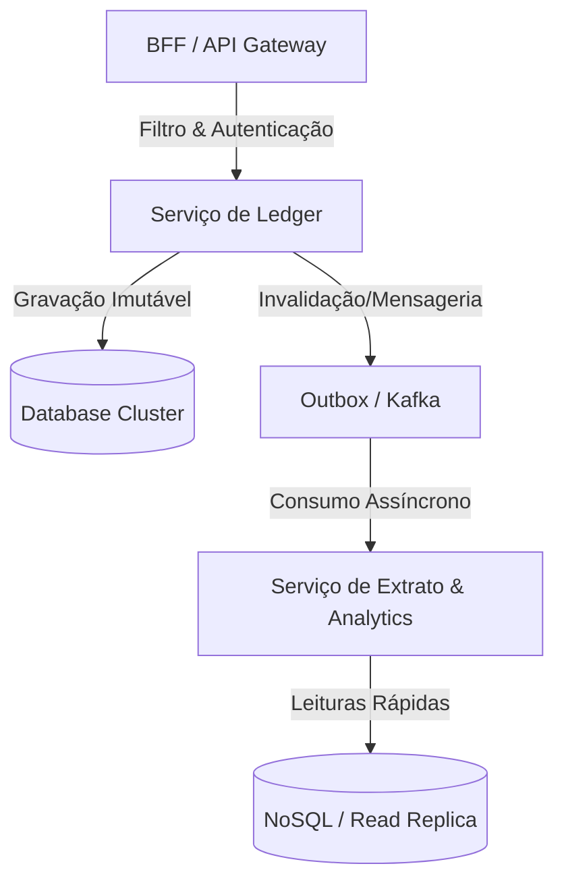

# 🏛️ Etapa 3: System Design Onsite - Ledger Financeiro Global

* **Responsável:** Alex (Staff Engineer) & Principal Engineer
* **Duração Recomendada:** 60 minutos
* **Foco:** Arquitetura de sistemas distribuídos de alta escala, modelos de dados, consistência, replicação e resiliência a falhas globais.

---

## 🎯 O Enunciado do Desafio

O candidato deve projetar a arquitetura de um **Ledger (Livro-Razão) Financeiro Global e Resiliente** para uma plataforma de pagamentos de grande porte (ex.: similar a Stripe, PayPal ou a carteira digital de uma Uber). 

Este sistema gerencia o saldo e o histórico de transferências de mais de **100 milhões de usuários ativos globais**.

### 📊 Requisitos e Escala de Big Tech

#### Requisitos Funcionais:
1. **Transferir Recursos:** Transferir dinheiro de forma atômica da conta `A` para a conta `B` (débito e crédito).
2. **Consulta de Saldo:** Retornar o saldo atual do usuário instantaneamente.
3. **Extrato Financeiro:** Listar transações históricas paginadas de forma cronológica reversa.

#### Requisitos Não-Funcionais (Escala e Restrições):
* **Throughput:** Suportar pico de **10.000 transações de escrita por segundo (TPS)** globalmente.
* **Consistência Estrita:** Garantia absoluta de consistência para transferências e saldos. Dinheiro não pode "surgir" ou "sumir" (Zero tolerância a perdas ou duplicações).
* **Disponibilidade (SLA):** Meta de **99.999% de disponibilidade (cinco noves)** para as escritas de transações.
* **Distribuição Geográfica:** O sistema opera em 3 regiões globais primárias (Américas, Europa e Ásia). A latência de leitura do saldo deve ser inferior a 100ms para qualquer usuário do mundo.

---

## 🗺️ Guia de Expectativas para Avaliação (Nível Staff L6+)

Candidatos de nível Staff são avaliados pelo seu rigor arquitetural, capacidade de antecipar gargalos físicos e análise detalhada dos compromissos operacionais (*trade-offs*). Espera-se que eles guiem o painel de forma proativa.

### 1. Modelo de Dados: Livro-Razão por Partida Dobrada (Double-Entry)
* **Expectativa Staff:** O candidato **deve** propor um modelo de escrituração de partida dobrada (Double-Entry Bookkeeping) usando registros imutáveis. Atualizar uma coluna `saldo` diretamente em uma tabela de `usuarios` é uma falha grave de design no nível Staff devido a gargalos de concorrência e perda de auditoria.
* **Esquema Esperado:** Duas tabelas fundamentais:
  * `accounts`: ID da conta, ID do usuário, Moeda, Status, Região.
  * `ledger_entries`: ID único, ID da transação, ID da conta debitada, ID da conta creditada, Valor, Timestamp. Cada transferência gera dois lançamentos atômicos (um débito e um crédito de valor simétrico).

### 2. Escolha Tecnológica do Banco de Dados
O candidato deve comparar e justificar a escolha do mecanismo de armazenamento:
* **Opção A: Bancos Relacionais Shardados (ex.: PostgreSQL):** Prós: Alta maturidade, transações ACID nativas locais. Contras: Complexidade operacional de sharding geográfico por usuário, gerenciar transações cross-shard manualmente (Sagas ou 2PC na aplicação).
* **Opção B: Distributed SQL (ex.: Google Cloud Spanner, CockroachDB):** Prós: Consistência estrita out-of-the-box, replicação geo-distribuída com consenso (Paxos/Raft), serializabilidade real global. Contras: Latência de escrita ligeiramente maior devido à coordenação de consenso WAN (velocidade da luz).
* **Opção C: NoSQL (ex.: DynamoDB ou Cassandra):** Prós: Escala horizontal massiva. Contras: Dificuldade em garantir consistência e atomicidade multi-registro sem adicionar alta complexidade na camada de aplicação.

> [!IMPORTANT]
> **O Veredito Staff:** Um candidato Staff deve identificar que a complexidade de gerenciar a consistência transacional financeira no nível da aplicação em NoSQL ou PostgreSQL shardado é um risco altíssimo de bugs operacionais. A escolha de um banco de dados SQL Distribuído (Spanner/CockroachDB) é geralmente a melhor escolha técnica para este problema de negócio específico (consistência sobre latência pura de escrita).

### 3. O Gargalo de Contas Quentes (Hot Accounts)
* **Cenário:** O que acontece quando uma conta muito popular (ex.: a conta de um grande seller da plataforma ou uma campanha de doação) recebe milhares de transações por segundo concorrentes?
* **Solução Staff:**
  * Implementação de **buffers/filas de escrita assíncronas** ou **sharding de conta (Split Accounts)**. Dividir a conta quente em múltiplos "sub-saldos" logicamente independentes (ex.: `Merchant_1`, `Merchant_2`) no banco para reduzir a disputa de locks de escrita, e consolidar o saldo total apenas nas leituras.

### 4. Distribuição Geográfica e Latência
* **Desafio:** Como garantir leituras globais rápidas de extrato sem ferir a consistência da escrita?
* **Solução Staff:**
  * Uso de arquitetura CQRS (Command Query Responsibility Segregation).
  * O Ledger grava as transações no banco principal consistente (Spanner).
  * O evento de gravação é propagado de forma confiável (usando o padrão *Transactional Outbox*) para um broker de mensageria (Kafka) e consumido por bancos de leitura otimizados localizados em cada região geográfica (ex.: Cassandra ou DynamoDB otimizados para busca de chaves cronológicas).

---

## ⚖️ Rubrica de Avaliação (Sinais de Senioridade)

### 🟥 Sinais Vermelhos (Red Flags)
* Desenha um monolito simples conectado a um banco MySQL único e sugere "aumentar a máquina virtual" para suportar 10k TPS.
* Sugere guardar saldo em caches (Redis/Memcached) como fonte da verdade financeira, expondo o sistema a inconsistências graves em caso de quedas ou reinicializações do cache.
* Não entende os custos da rede e a velocidade da luz em replicações geográficas de escrita.

### 🟨 Senior Engineer (L5 - Esperado)
* Consegue projetar uma arquitetura de microsserviços desacoplada e escalável.
* Propõe modelo de dados adequado (Double-entry) e reconhece a necessidade de isolamento de transações.
* Consegue desenhar um fluxo básico de CQRS com mensageria para a leitura de extratos.

### 🟩 Staff Engineer (L6+ - Excelente)
* Lidera a conversa e formula o escopo técnico mapeando requisitos funcionais e não funcionais em 5 minutos.
* Identifica proativamente o gargalo de **Hot Accounts** e propõe estratégias de sharding de contas.
* Detalha cenários complexos de tolerância a falhas (ex.: falha de rede parcial entre regiões globais, como lidar com o Split-Brain no cluster de consenso).
* Analisa custos e trade-offs realistas das soluções de forma pragmática (ex.: o custo de licença/operação de banco distribuído globalmente vs a complexidade técnica de sharding manual de PostgreSQL).

---

[Ir para a Etapa 4: Coding Onsite ](./04-coding-resilience-onsite.md)
