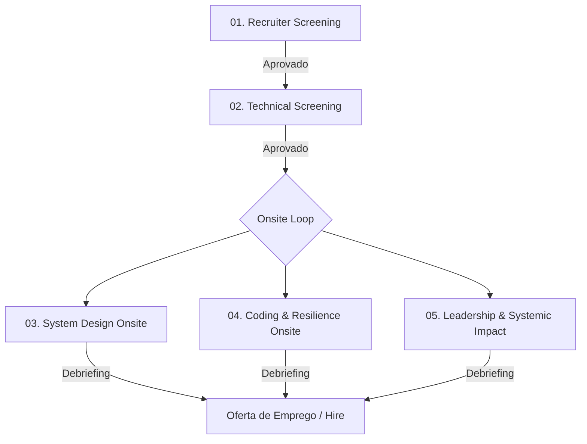

# 🎯 Staff Engineer Recruitment Pipeline: FinTech Platform Team

Seja bem-vindo ao repositório de simulação de contratação para a posição de **Staff Software Engineer** no time de **FinTech Platform** da nossa Big Tech. 

Este repositório foi construído em colaboração direta entre a liderança de **Tech Recruiting** e a guilda de **Staff+ Engineers** para servir como o padrão ouro de avaliação técnica e cultural de candidatos sêniores e staff.

---

## 👥 As Personas do Processo

O processo é desenhado e avaliado sob duas perspectivas complementares:

### 💼 A Recrutadora Técnica (Gaby)
* **Foco:** Fit cultural profundo, habilidades de comunicação, liderança por influência sem autoridade formal, inteligência emocional e resolução de conflitos.
* **Critério de Sucesso:** Identificar se o candidato consegue elevar o nível cultural da engenharia e se comunicar efetivamente com stakeholders de produto, executivos e engenheiros juniores.

### 🛠️ O Staff Engineer (Alex)
* **Foco:** Excelência técnica prática, visão sistêmica de longo prazo, capacidade de desenhar sistemas de altíssima escala sob restrições extremas, tolerância a falhas e gerenciamento de débito técnico.
* **Critério de Sucesso:** Avaliar se o candidato consegue desenhar e guiar a arquitetura de sistemas globais (10k+ TPS) com consistência estrita, sem perder de vista a manutenibilidade e os custos operacionais.

---

## 🗺️ O Pipeline de Contratação (End-to-End)

O processo é dividido em **5 etapas consecutivas**. Cada etapa possui um guia dedicado contendo as perguntas do entrevistador, os requisitos, o desafio prático (se aplicável) e as rubricas de avaliação detalhadas.

### 🔗 Navegação pelas Etapas

1. **[Etapa 1: Recruiter Phone Screen](./01-recruiter-screening.md)**
   * *Responsável:* Tech Recruiter (Gaby).
   * *Foco:* Alinhamento cultural, trajetória de carreira, motivação e triagem comportamental preliminar usando a metodologia STAR.
2. **[Etapa 2: Technical Screening](./02-technical-screening.md)**
   * *Responsável:* Staff Engineer / Senior Engineer.
   * *Foco:* Fundamentos rápidos de sistemas distribuídos, redes, concorrência, e um pequeno exercício de design conceitual de idempotência.
3. **[Etapa 3: System Design Onsite](./03-system-design-onsite.md)**
   * *Responsável:* Staff Engineer (Alex) & Principal Engineer.
   * *Foco:* Projeto de arquitetura ponta a ponta: *Ledger de Transações Financeiras Global e Idempotente*.
4. **[Etapa 4: Coding & Resilience Onsite](./04-coding-resilience-onsite.md)**
   * *Responsável:* Staff Engineer & Senior Engineer.
   * *Foco:* Desafio prático de codificação concorrente e resiliente (Buffer/Queue com Rate Limiter e Retries com Jitter).
5. **[Etapa 5: Leadership & Systemic Impact Onsite](./05-leadership-systemic-impact.md)**
   * *Responsável:* Director of Engineering & Staff Engineer.
   * *Foco:* Liderança por influência, resolução de conflitos técnicos profundos, gestão de débito técnico e tomada de decisões difíceis de arquitetura.

---

> [!IMPORTANT]
> **Expectativa para Nível Staff (L6+)**:
> Diferente de engenheiros seniores (L5), candidatos a Staff Engineer são avaliados pelo seu **impacto multiplicador**. Não buscamos apenas quem saiba escrever código limpo ou projetar um serviço isolado. Buscamos engenheiros que definam a direção técnica de múltiplos times, que guiem decisões arquiteturais complexas sob alta incerteza e que consigam traduzir metas de negócio complexas em arquiteturas técnicas elegantes e viáveis.
