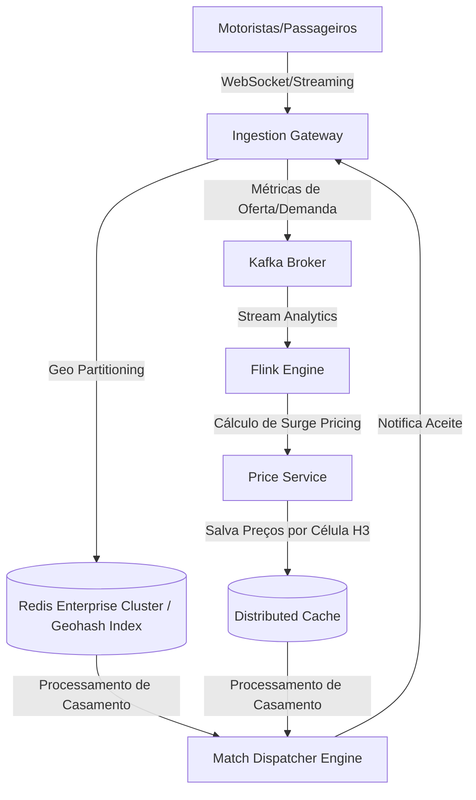

# 🏛️ Trilha 2 - Etapa 3: System Design Onsite - Matcher & Dynamic Pricing

* **Responsável:** Alex (Staff Engineer) & Principal Engineer
* **Duração Recomendada:** 60 minutos
* **Foco:** Arquiteturas de estado volátil, processamento geoespacial em escala, pub-sub massivo e cálculo matemático em tempo real.

---

## 🎯 O Enunciado do Desafio

Projete a arquitetura do **Sistema de Despacho e Preço Dinâmico (Surge Pricing)** de um aplicativo de mobilidade urbana em escala global. 

O sistema deve monitorar as posições de **10 milhões de motoristas ativos** e **50 milhões de passageiros**, pareando-os de forma ideal e ajustando os preços por região a cada 10 segundos com base na oferta e demanda locais.

---

## 🗺️ Guia de Expectativas para Avaliação (Nível Staff L6+)

### 1. Ingestão de Telemetria Geográfica de Alta Carga
* **Escala:** 10M de motoristas enviando ping GPS a cada 4 segundos equivale a **2.5 milhões de requisições de escrita por segundo**.
* **Discussão Staff:** O candidato deve propor o descarte ou agrupamento imediato das coordenadas no Gateway antes de persistir no banco. Não devemos salvar todo ping GPS bruto em um banco relacional ou NoSQL em disco. A melhor solução é manter a última posição conhecida em um cache de memória geoespacial (ex.: Redis com comandos GEO ou bancos especializados em memória) com TTL curto.

### 2. Algoritmo de Pareamento (Matching Engine)
* **Desafio:** Como casar motorista e passageiro minimizando o tempo de chegada (ETA) e otimizando a taxa de conversão?
* **Solução Staff:** 
  * Rejeitar a abordagem ingênua de "pegar o motorista mais próximo imediatamente" (First-In, First-Out simples). Isso gera ineficiências globais (gargalo de ordenação).
  * O candidato deve sugerir o **Batch Matching**: coletar solicitações de corrida e motoristas disponíveis em uma mesma janela de tempo pequena (ex.: 3 a 5 segundos) em uma área do grid H3, e rodar um algoritmo de otimização combinatória (como o algoritmo húngaro ou busca local) para encontrar a melhor combinação de pares que minimize o ETA médio da região.

### 3. Motor de Preço Dinâmico (Surge Pricing)
* **Desafio:** Como calcular o multiplicador de preço por região a cada 10 segundos?
* **Solução Staff:**
  * Uso de computação em fluxo (*Stream Processing*) com Apache Flink ou Spark Streaming para contar a quantidade de passageiros buscando corrida (demanda) vs motoristas vazios (oferta) dentro de uma célula H3 em janelas deslizantes (*sliding windows*).
  * O preço dinâmico calculado é salvo em um cache distribuído global e lido pelo serviço de cotação de corrida instantaneamente.

---

## ⚖️ Rubrica de Avaliação (Sinais de Senioridade)

### 🟥 Sinais Vermelhos (Red Flags)
* Tenta persistir cada ping de localização de motoristas (2.5M TPS) em um banco de dados relacional clássico (PostgreSQL) com transações pesadas de escrita física em disco.
* Não considera o problema de concorrência: dois passageiros sendo pareados com o mesmo motorista ao mesmo tempo (Race Condition clássica de despacho).

### 🟩 Staff Engineer (L6+)
* Identifica que o maior desafio é a volatilidade do estado (dados mudam a cada segundo) e resolve usando Redis/caching em memória com TTLs agressivos.
* Propõe **Batch Matching** em vez de pareamento síncrono/imediato e explica como a otimização combinatória local melhora o faturamento do negócio.
* Detalha o tratamento de concorrência (ex.: lock distribuído de curta duração na conta do motorista no momento de despachar a oferta de corrida).

---

[Ir para a Etapa 4: Coding Onsite ](./04-coding-matching-onsite.md)
