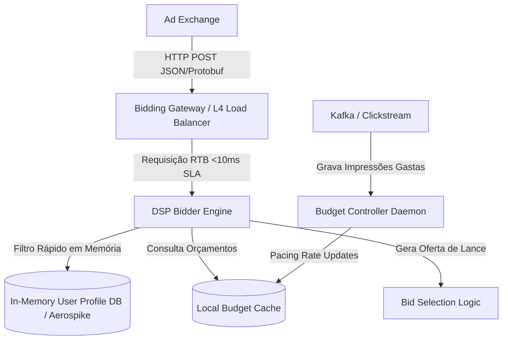

# 🏛️ Trilha 3 - Etapa 3: System Design Onsite - Ad Real-Time Bidding

* **Responsável:** Alex (Staff Engineer) & Principal Engineer
* **Duração Recomendada:** 60 minutos
* **Foco:** Sistemas de altíssimo throughput, processamento com SLA rígido de sub-10ms, coordenação e controle distribuído de orçamentos (Budget Pacing).

---

## 🎯 O Enunciado do Desafio

Projete uma plataforma de **Real-Time Bidding (RTB)** que processa requisições de leilão de espaços publicitários vindas de Ad Exchanges.

### 📊 Requisitos e Escala
* **Carga de Escrita/Decisão:** Suportar **1 milhão de requisições por segundo (RPS)** na API de leilão.
* **SLA de Tempo de Resposta:** Responder em no máximo **10ms** no servidor (tempo disponível para o processamento de decisão interno).
* **Gestão de Orçamentos (Budget Pacing):** O sistema deve ler os limites diários de orçamento de milhares de anunciantes ativos e parar de licitar assim que o orçamento acabar. Para evitar que um anunciante com R$ 1.000 gaste tudo em 10 milissegundos devido à concorrência paralela massiva, devemos distribuir o orçamento uniformemente ao longo do dia (*pacing*).

---

## 🗺️ Guia de Expectativas para Avaliação (Nível Staff L6+)

### 1. Garantir Latência no Servidor de Sub-10ms
* **Desafio:** Como processar lógica de decisão com 1M RPS dentro do limite de 10ms?
* **Solução Staff:** 
  * O candidato deve evitar queries ao banco de dados relacional clássico no caminho da requisição. Toda informação relevante (perfil do usuário, inventário de anúncios ativos e orçamentos) deve estar em cache local na memória RAM da aplicação ou em bancos NoSQL de latência de sub-milissegundo em memória (ex.: Aerospike ou Redis Enterprise).
  * Uso de serialização compacta e comunicação eficiente (gRPC, HTTP/2 ou conexões UDP).

### 2. Controle Distribuído de Orçamentos (Budget Pacing)
* **O Problema:** Em 1M RPS, se o anunciante X tem R$ 10 de orçamento restante, centenas de threads concorrentes podem licitar simultaneamente achando que o orçamento ainda existe. Isso causa "over-delivery" grave (prejuízo para a empresa).
* **Solução Staff:**
  * Uso de **Budget Pacing Distribuído com Tokens**: O controlador de orçamento calcula a taxa de consumo desejada por segundo e atualiza periodicamente caches locais da memória de cada servidor (DSP Bidders) com uma cota temporária (ex.: liberar R$ 0.10 a cada 100ms para cada servidor). Os servidores consomem localmente essa cota de forma atômica e extremamente rápida em memória RAM local, eliminando locks distribuídos em rede a cada requisição.

---

## ⚖️ Rubrica de Avaliação (Sinais de Senioridade)

### 🟥 Sinais Vermelhos (Red Flags)
* Propõe usar Redis distribuído compartilhado único com locks globais `SETNX` de rede a cada requisição de bid para checar o orçamento dos anunciantes (isso destrói o SLA de 10ms instantaneamente).
* Propõe ler dados de perfil de usuários em bancos SQL relacionais clássicos a cada requisição.

### 🟩 Staff Engineer (L6+)
* Identifica o trade-off crítico: para manter <10ms, é preferível ter eventual consistência leve no controle de orçamentos (aceitando pequenos estouros toleráveis) em troca de performance pura.
* Desenha uma arquitetura onde a camada de execução de lance é completamente separada (decoupled) da camada de reconciliação de orçamentos por mensageria assíncrona.

---

[Ir para a Etapa 4: Coding Onsite ](./04-coding-bidding-onsite.md)
