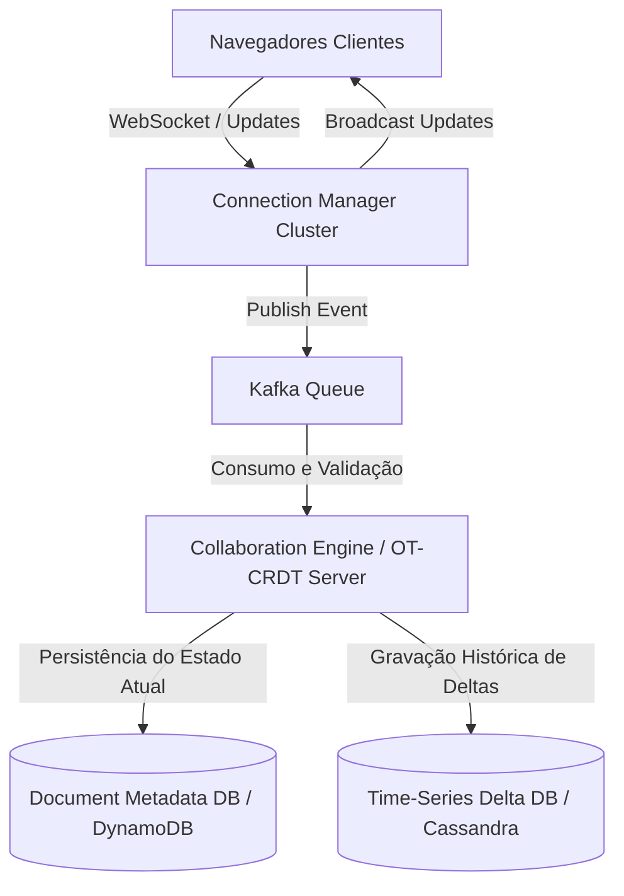

# 🏛️ Trilha 4 - Etapa 3: System Design Onsite - Collaborative Document Editor

* **Responsável:** Alex (Staff Engineer) & Principal Engineer
* **Duração Recomendada:** 60 minutos
* **Foco:** Consistência eventual, algoritmos de reconciliação de estado, gerência de conexões WebSocket persistentes e persistência eficiente de deltas.

---

## 🎯 O Enunciado do Desafio

Projete a arquitetura de um **Editor de Documentos Colaborativo em Tempo Real** (estilo Google Docs) que suporte **10 milhões de usuários ativos diários** editando documentos concorrentemente com latência visual abaixo de 50ms. O sistema deve suportar edição offline e fundir as mudanças automaticamente ao reconectar.

---

## 🗺️ Guia de Expectativas para Avaliação (Nível Staff L6+)

### 1. Modelo de Consistência e Otimização Combinatória (OT vs. CRDT)
* **Desafio:** Como garantir que todos os clientes vejam o mesmo texto exato após digitações simultâneas?
* **Solução Staff:** O candidato deve comparar e justificar a escolha entre:
  * **Operational Transformation (OT):** Centralizado. O servidor recebe as operações (inserir caractere na posição X, apagar na Y), transforma os índices com base no histórico de operações do servidor e faz o broadcast da transformação. Prós: Fácil de gerenciar permissões e tamanho do documento. Contras: Depende de um servidor central único como coordenador de ordem de verdade.
  * **CRDT (Conflict-free Replicated Data Types - ex.: Yjs ou Automerge):** Descentralizado. Cada caractere inserido ganha um ID único universal (ex.: `(Autor_1, 0.5)`). As operações são comutativas e associativas por design matemático. Prós: Excelente para P2P e edição offline prolongada. Contras: Alto overhead de metadados em memória (o tamanho do arquivo em metadados pode crescer muito).

### 2. Gerenciamento de 1 Milhão de Conexões WebSocket Simultâneas
* **Desafio:** Como gerenciar e distribuir as conexões WebSocket persistentes entre centenas de servidores?
* **Solução Staff:** 
  * Propor arquitetura de **Connection Gateway Cluster** que apenas gerencia conexões TCP e encaminha os payloads para serviços de backend via filas (Kafka) de forma assíncrona.
  * Uso de um barramento de eventos pub-sub rápido (como Redis Pub/Sub ou Apache Pulsar) para enviar as atualizações das edições de volta para as instâncias do Connection Gateway que possuem clientes conectados ao documento específico.

---

## ⚖️ Rubrica de Avaliação (Sinais de Senioridade)

### 🟥 Sinais Vermelhos (Red Flags)
* Propõe que os clientes façam pooling HTTP a cada 500ms para salvar o documento inteiro na base SQL em formato TEXT a cada digitação.
* Não considera cenários offline; ao reconectar, o cliente simplesmente sobrescreve o estado do servidor perdendo as alterações de outros usuários (*lost updates*).

### 🟩 Staff Engineer (L6+)
* Domina a teoria matemática e prática de convergência de estado (OT e CRDT).
* Descreve detalhadamente o gerenciamento de memória no servidor ao lidar com grandes buffers de documentos abertos simultaneamente.
* Apresenta um plano realista de persistência: salvar snapshots completos periodicamente em NoSQL em disco (ex.: a cada 30 segundos) e manter o diário de deltas (diffs) em formato append-only rápido.

---

[Ir para a Etapa 4: Coding Onsite ](./04-coding-crdt-onsite.md)
