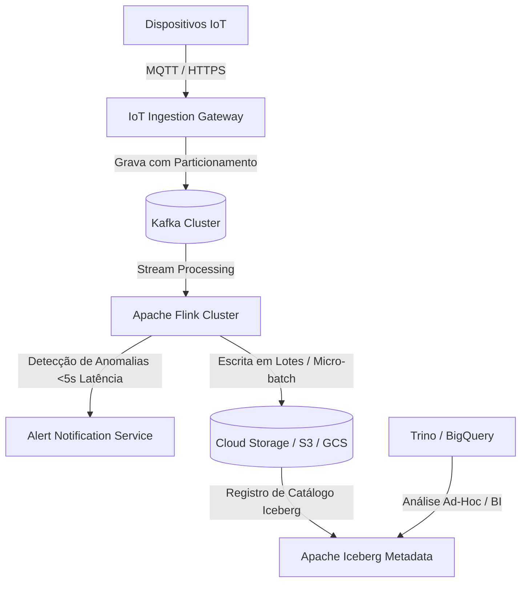

# 🏛️ Trilha 5 - Etapa 3: System Design Onsite - IoT Ingestion Pipeline

* **Responsável:** Alex (Staff Engineer) & Principal Engineer
* **Duração Recomendada:** 60 minutos
* **Foco:** Pipelines de ingestão em larga escala, controle de Backpressure, tolerância a eventos atrasados e arquiteturas Lakehouse.

---

## 🎯 O Enunciado do Desafio

Projete um pipeline de dados para **ingestão, armazenamento e detecção de anomalias** em tempo real a partir de **10 milhões de dispositivos IoT** industriais enviando telemetria (temperatura, vibração, etc.) a cada 5 segundos (2 milhões de eventos/segundo). O sistema deve alertar se a média de vibração de um motor nos últimos 5 minutos passar de um limite de segurança.

---

## 🗺️ Guia de Expectativas para Avaliação (Nível Staff L6+)

### 1. Ingestão e Arquitetura MQTT/Gateway
* **Escala:** 2 milhões de eventos/segundo.
* **Discussão Staff:** O candidato deve propor o uso de protocolo leve como MQTT com gateways distribuídos para gerenciar o handshake TCP dos dispositivos de forma eficiente. O gateway deve converter e serializar as mensagens em formato binário compacto (ex.: Protobuf) antes de jogar no Kafka.

### 2. Processamento em Fluxo e Eventos Atrasados (Late Events)
* **Desafio:** Como agregar dados por janelas de tempo corretas se pacotes de dados atrasarem na rede de telefonia celular dos dispositivos?
* **Solução Staff:** 
  * O candidato deve descartar o uso de tempo de processamento (*processing time*) do servidor e usar estritamente o **tempo do evento (event time)** contido na mensagem gerada pelo dispositivo.
  * Uso de **Watermarks (Marcas D'água)** no Apache Flink para definir até quanto tempo o sistema espera por dados atrasados antes de fechar a janela analítica e disparar o alerta ou agregar no banco.

### 3. Backpressure e Controle de Sobrecarga
* **Desafio:** Se o Flink ou o banco analítico desacelerar, como evitar que o sistema exploda em memória?
* **Solução Staff:** 
  * O candidato deve desenhar um fluxo com controle reativo de fluxo (*Backpressure*).
  * O Kafka serve como buffer físico durável. Se o Flink desacelera, ele reduz a taxa de leitura do Kafka.
  * Se o Kafka estiver prestes a estourar o limite de retenção física, o Ingestion Gateway deve receber sinal de congestionamento e começar a descartar dados não críticos na borda (*load shedding*), notificando os dispositivos via HTTP 429 ou sinal MQTT para retardar o envio de dados.

---

## ⚖️ Rubrica de Avaliação (Sinais de Senioridade)

### 🟥 Sinais Vermelhos (Red Flags)
* Desenha um pipeline onde cada evento de métrica IoT é salvo imediatamente de forma síncrona em uma base de dados relacional clássica, ignorando o volume de 2M TPS em disco.
* Não entende a diferença entre tempo de evento (*event time*) e tempo de processamento (*processing time*), gerando agregações analíticas incorretas caso haja oscilação de sinal de rede dos dispositivos.

### 🟩 Staff Engineer (L6+)
* Domina conceitos de teoria de stream processing (Watermarks, Windows, Chandy-Lamport algorithm para checkpointing de Flink).
* Propõe arquitetura de Data Lakehouse unificada (Parquet + Apache Iceberg/Delta Lake) para permitir consultas analíticas eficientes sobre petabytes de dados armazenados de forma barata.

---

[Ir para a Etapa 4: Coding Onsite ](./04-coding-stream-onsite.md)
