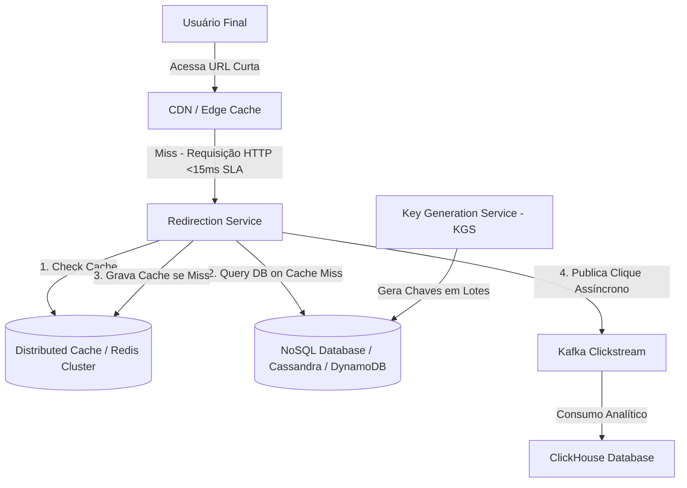

# 🏛️ Trilha 6 - Etapa 3: System Design Onsite - Scale URL Shortener

* **Responsável:** Alex (Staff Engineer) & Principal Engineer
* **Duração Recomendada:** 60 minutos
* **Foco:** Key Generation Service (KGS), sharding de banco NoSQL, estratégias de caching massivas e ingestão de clickstream em tempo real.

---

## 🎯 O Enunciado do Desafio

Projete uma plataforma de **Encurtamento de URLs e Coleta de Métricas Analíticas** global em larga escala.

### 📊 Requisitos e Escala de Big Tech
* **Tráfego de Leitura (Redirecionamento):** Suportar **100.000 requisições por segundo (QPS)** globais de leitura.
* **Tráfego de Escrita (Encurtamento):** Suportar **1.000 novas URLs encurtadas por segundo**.
* **Latência de Redirecionamento:** O redirecionamento (da URL curta para a original) deve ocorrer em menos de **15ms** na CDN/Edge ou no servidor.
* **Analytics:** Capturar informações de cliques (IP, Referer, User-Agent, Timestamp) para gerar relatórios diários de acessos sem degradar a velocidade do redirecionamento.

---

## 🗺️ Guia de Expectativas para Avaliação (Nível Staff L6+)

### 1. Key Generation Service (KGS)
* **Desafio:** Como garantir que o gerador de chaves Base62 distribua chaves únicas sem colisões sob escrita massiva distribuída?
* **Solução Staff:** 
  * Rejeitar a geração dinâmica de hash no momento da escrita (risco de colisão e alto custo de CPU de criptografia).
  * O candidato deve propor o **Key Generation Service (KGS)**. Um serviço que roda em background pré-gerando chaves aleatórias únicas de 7 caracteres e salvando-as em uma tabela.
  * Os servidores de aplicação (Shortener Bidders) buscam blocos/lotes de chaves prontas do KGS e guardam na memória RAM para usar instantaneamente quando um usuário pedir para encurtar um link. Para evitar que dois servidores usem a mesma chave, o KGS pode gerenciar a alocação distribuída usando Zookeeper/Consul para distribuir faixas exclusivas de IDs de chave.

### 2. Caching Massivo de Leitura (100k QPS)
* **Discussão Staff:** O redirecionamento é uma operação de 99% leitura e 1% escrita.
* **Solução Staff:**
  * Uso intensivo de Caching na Borda (CDN/Edge) respondendo com cabeçalhos de expiração adequados para que cliques repetidos nem cheguem aos nossos servidores.
  * O Redirection Service consulta um cluster distribuído Redis em memória. Como o tráfego de leitura é massivo, o Redis deve usar topologia de replicação Master-Slave com múltiplas réplicas de leitura distribuídas localmente próximas às regiões de acesso.

### 3. Pipeline de Analytics Desacoplado
* **Desafio:** Salvar metadados de cliques para 100k QPS sem penalizar o tempo de redirecionamento.
* **Solução Staff:**
  * O Redirection Service deve processar a gravação analítica de forma totalmente assíncrona. Assim que localiza a URL destino, o serviço envia a resposta HTTP 302 para o cliente e dispara um evento em background para um broker de mensageria durável (Apache Kafka) contendo os dados do clique.
  * O evento é processado assincronamente por consumidores e salvo em bancos colunares analíticos (como ClickHouse ou Snowflake), ideais para agregação e relatórios.

---

## ⚖️ Rubrica de Avaliação (Sinais de Senioridade)

### 🟥 Sinais Vermelhos (Red Flags)
* Propõe que a API consulte um banco SQL clássico único (Postgres/MySQL) usando cláusula `WHERE short_url = X` para cada um dos 100k cliques de leitura por segundo.
* Tenta coordenar a exclusividade de novas chaves geradas em tempo de escrita fazendo consultas bloqueantes `SELECT EXISTS` no banco de dados operacional.

### 🟩 Staff Engineer (L6+)
* Identifica que o KGS com alocação em lotes e persistência em NoSQL estruturado (shardeado por hash da URL curta) elimina contenção e garante latências de sub-milissegundos.
* Explica o balanceamento geográfico de leituras de caches (Redis Read Replicas e CDN caching).
* Demonstra conhecimento em otimização de bancos de dados colunares analíticos para relatórios de clickstream em alta escala.

---

[Ir para a Etapa 4: Coding Onsite ](./04-coding-shortener-onsite.md)
