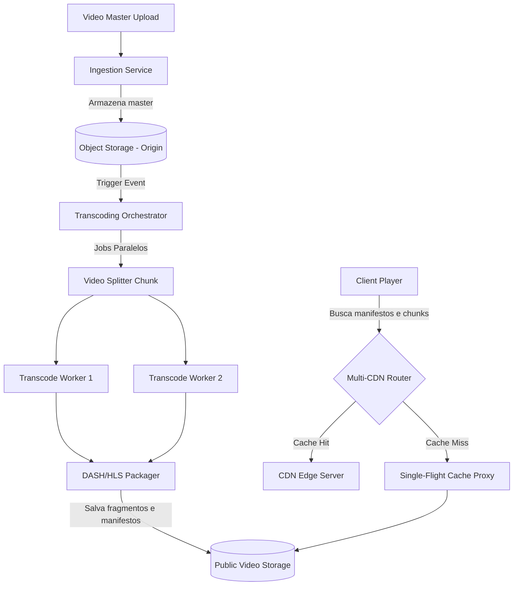

# 🏛️ Etapa 3: System Design Onsite - Pipeline Global de Encoding e CDN Edge Cache

* **Responsável:** Alex (Staff Engineer) & Principal Engineer
* **Duração Recomendada:** 60 minutos
* **Foco:** Arquitetura de ingestão de mídia, processamento assíncrono de vídeo, empacotamento dinâmico (HLS/DASH), caching geográfico e controle de custos de tráfego de rede (egress).

---

## 🎯 O Enunciado do Desafio

O candidato deve projetar a infraestrutura de backend de uma **Plataforma de Streaming de Vídeo Global** (VoD) sob demanda com foco em escalabilidade, resiliência a picos de acessos regionais e otimização financeira de rede. 

O sistema deve atender a mais de **50 milhões de usuários ativos mensais** e gerenciar um catálogo de petabytes de mídia.

### 📊 Requisitos e Escala

#### Requisitos Funcionais:
1. **Ingestão de Mídia**: Permitir o upload seguro de arquivos master de vídeo de alta resolução (4K/ProRes).
2. **Processamento (Transcoding)**: Codificar o master em múltiplos formatos e resoluções (ex.: 1080p, 720p, 480p) e codecs (H.264, VP9, AV1).
3. **Player Streaming**: Disponibilizar manifestos HLS (HTTP Live Streaming) e DASH com suporte a bitrate adaptativo (ABR).

#### Requisitos Não-Funcionais (Escala e Custos):
* **Ultra Latência de Inicialização**: O vídeo deve começar a rodar em menos de 1.5 segundo em qualquer lugar do mundo (Fast Video Startup).
* **Mitigação de Custos**: Reduzir ao máximo as taxas de egress de rede cobradas por provedores de nuvem para entrega pública.
* **Resiliência a Rajadas de Tráfego**: Suportar o lançamento de uma série viral onde 5 milhões de usuários assistem ao mesmo arquivo simultaneamente na primeira hora de lançamento.

---

## 🗺️ Guia de Expectativas para Avaliação (Nível Staff L6+)

Espera-se que o candidato desenhe uma divisão limpa entre o fluxo de **Gravação/Processamento (Ingestion & Transcoding)** e o fluxo de **Leitura/Consumo (CDN Delivery)**.

### 1. Ingestion & Transcoding Distribuído
* **Expectativa Staff**: Processar um vídeo master inteiro de 2 horas como um arquivo único geraria gargalos severos de memória e falhas em lote. O candidato **deve** propor o fracionamento do vídeo master em pequenos chunks lógicos (ex: trechos de 5 a 10 segundos).
* **Paralelização**: Esses chunks devem ser processados em paralelo usando arquitetura orientada a eventos (ex: filas de tarefas usando Spot VMs para otimização de custo). O consolidador monta os manifestos `.m3u8` ou `.mpd` após a conclusão das tarefas paralelas de codificação.

### 2. A Prevenção de Cache Stampede na Borda (Thundering Herd)
* **Cenário**: Quando um novo episódio popular é publicado, as CDNs inicialmente não possuem esses chunks cacheados (Cache Miss). Se milhões de usuários buscarem os primeiros segundos de vídeo simultaneamente, as requisições irão direto para o Object Storage de origem, derrubando o servidor ou gerando contas de I/O astronômicas.
* **Solução Staff**:
  * Uso do padrão **Single-Flight (Request Collapsing)** na camada de origem/proxy. Quando a CDN de borda faz um bypass em caso de miss, o servidor proxy colapsa todas as requisições pelo mesmo chunk (.ts) em trânsito em uma única chamada física ao Object Storage, propagando a resposta (broadcast) para os leitores simultâneos.

### 3. Otimização de Custos de Cloud Egress
* **Expectativa Staff**: Os custos de transferência de dados da nuvem para a internet pública (Egress) são a maior fatia de custo em streaming.
* **Solução**:
  * Implementação de uma arquitetura **Multi-CDN** para negociar tarifas mais baixas baseadas em rotas regionais e volumes de tráfego.
  * Empregar compressão eficiente usando codecs modernos (VP9/AV1) que reduzem o tamanho dos arquivos em até $40\%$ em comparação com o H.264 clássico, mantendo a mesma qualidade perceptiva.

---

## ⚖️ Rubrica de Avaliação (Sinais de Senioridade)

### 🟥 Sinais Vermelhos (Red Flags)
* Sugere salvar vídeos em bancos de dados relacionais ou no disco local de um único servidor.
* Não entende o conceito de bitrate adaptativo (HLS/DASH), projetando apenas download estático de arquivos `.mp4`.
* Desconhece a existência de taxas de Egress de dados de rede.

### 🟨 Senior Engineer (L5)
* Desenha um pipeline de transcoding básico e utiliza serviços de fila (ex: SQS) para gerenciar jobs.
* Configura CDNs e entende o funcionamento de cache hierárquico (Shield Cache).
* Entende a necessidade de codecs diferentes para dispositivos móveis vs. desktop.

### 🟩 Staff Engineer (L6+)
* Aborda ativamente a mitigação de **Cache Stampede** usando Single-Flight ou caches de pré-aquecimento (*pre-warming*).
* Propõe sharding regional inteligente de mídias e roteador de Multi-CDN dinâmico baseado em custos e qualidade do tráfego (RUM - Real User Monitoring).
* Demonstra conhecimento profundo dos formatos de transmissão (HLS/CMAF) e o impacto de latência e consumo de CPU do decodificador no cliente.
