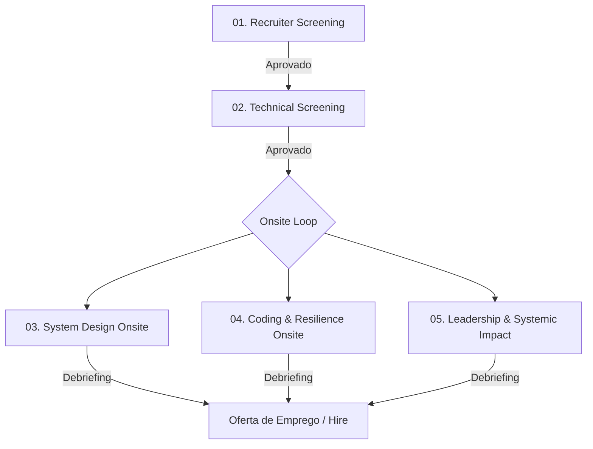

# 🎯 Staff Engineer Recruitment Pipeline: Core Media & CDN Platform

Seja bem-vindo ao repositório de simulação de contratação para a posição de **Staff Software Engineer** no time de **Core Media & CDN Platform** da nossa Big Tech.

Este espaço foi estruturado em cooperação direta entre o time de **Tech Recruiting** e a guilda de **Staff+ Engineers** para a avaliação técnica e de liderança prática em sistemas de altíssimo volume de dados e egress de rede.

---

## 👥 As Personas do Processo

O processo é desenhado e avaliado sob duas perspectivas complementares:

### 💼 A Recrutadora Técnica (Gaby)
* **Foco:** Inteligência emocional, comunicação de temas de infraestrutura para stakeholders de produto, liderança técnica cross-team sem autoridade formal e gestão de budget técnico.
* **Critério de Sucesso:** Identificar se o candidato consegue traduzir problemas de latência e custos de rede em valor de negócio para a empresa e gerenciar impasses.

### 🛠️ O Staff Engineer (Alex)
* **Foco:** Arquitetura de transmissão de vídeo (HLS/DASH), caching de borda (CDNs), otimização de I/O a nível de sistema operacional (Zero-Copy) e backpressure em nível de thread e rede.
* **Critério de Sucesso:** Avaliar se o candidato domina os trade-offs físicos de infraestrutura de rede, protocolos de aplicação (HTTP/3, TCP vs UDP) e custos de cloud a nível global.

---

## 🗺️ O Pipeline de Contratação (End-to-End)

O processo é dividido em **5 etapas consecutivas**. Cada etapa possui um guia dedicado contendo as perguntas do entrevistador, os requisitos, o desafio prático (se aplicável) e as rubricas de avaliação detalhadas.

### 🔗 Navegação pelas Etapas

1. **[Etapa 1: Recruiter Phone Screen](./01-recruiter-screening.md)**
   * *Foco:* Alinhamento cultural, motivação, gestão de projetos de infraestrutura complexos e fit de carreira.
2. **[Etapa 2: Technical Screening](./02-technical-screening.md)**
   * *Foco:* Fundamentos de rede (TCP/UDP, HTTP/2 vs HTTP/3), buffering em memória, concorrência e noções básicas de processamento de mídia.
3. **[Etapa 3: System Design Onsite](./03-system-design-onsite.md)**
   * *Foco:* Projeto de arquitetura ponta a ponta: *Pipeline Global de Encoding e CDN Edge Cache*.
4. **[Etapa 4: Coding & Resilience Onsite](./04-coding-throttler-onsite.md)**
   * *Foco:* Desafio de código prático: *Simulador de Gateway de Vídeo Concorrente com Backpressure*.
5. **[Etapa 5: Leadership & Systemic Impact Onsite](./05-leadership-systemic-impact.md)**
   * *Foco:* Liderança situacional, gestão de custos de egress astronômicos e negociação de limites técnicos com produto.

---

> [!IMPORTANT]
> **Expectativa para Nível Staff (L6+)**:
> O candidato deve demonstrar que vídeo não é apenas "enviar arquivos". Espera-se que ele entenda compressão de vídeo (codecs), protocolos de rede sob perda de pacotes móveis, custo real de entrega de gigabytes por segundo na nuvem e design de proxies estáveis sob alta concorrência.
