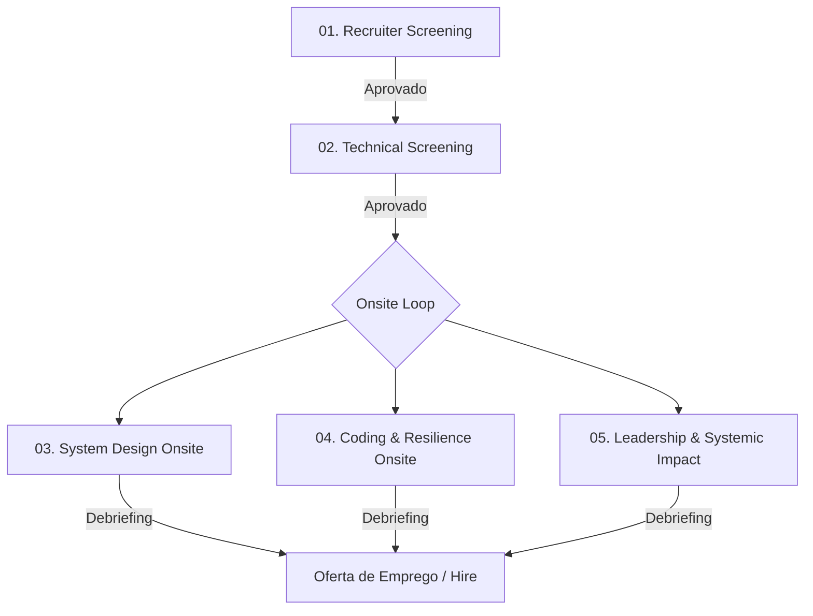

# 🎯 Staff Engineer Recruitment Pipeline: Social Network Feed Engine

Seja bem-vindo ao repositório de simulação de contratação para a posição de **Staff Software Engineer** no time de **Core Feed & Social Graph Platform** da nossa Big Tech.

Este espaço foi estruturado em cooperação direta entre o time de **Tech Recruiting** e a guilda de **Staff+ Engineers** para a avaliação técnica e de liderança prática em sistemas de alto volume de escritas concorrentes, cache distribuído e consistência eventual em grafos sociais.

---

## 👥 As Personas do Processo

O processo é desenhado e avaliado sob duas perspectivas complementares:

### 💼 A Recrutadora Técnica (Gaby)
* **Foco:** Habilidades interpessoais, comunicação estruturada, gestão de times sob alta pressão, resolução de impasses técnicos e mentoria de engenheiros seniores e líderes de equipe.
* **Critério de Sucesso:** Avaliar se o candidato consegue agir como um catalisador de boas práticas e unificar times focados em caminhos técnicos opostos.

### 🛠️ O Staff Engineer (Alex)
* **Foco:** Algoritmos de ordenação em memória de grande porte, concorrência lock-free, gerenciamento de pressão de Garbage Collection (GC) e trade-offs CAP/PACELC aplicados a timelines de redes sociais.
* **Critério de Sucesso:** Avaliar se o candidato compreende a física por trás de grandes volumes de leitura e escrita e sabe contornar gargalos de rede e I/O de forma robusta.

---

## 🗺️ O Pipeline de Contratação (End-to-End)

O processo é dividido em **5 etapas consecutivas**. Cada etapa possui um guia dedicado contendo as perguntas do entrevistador, os requisitos, o desafio prático (se aplicável) e as rubricas de avaliação detalhadas.

### 🔗 Navegação pelas Etapas

1. **[Etapa 1: Recruiter Phone Screen](./01-recruiter-screening.md)**
   * *Foco:* Alinhamento comportamental, liderança situacional em momentos de reestruturação de equipes e fit cultural.
2. **[Etapa 2: Technical Screening](./02-technical-screening.md)**
   * *Foco:* Fundamentos de bancos de grafos, modelagem de banco NoSQL/Chave-Valor e teoria de fan-out (push vs. pull).
3. **[Etapa 3: System Design Onsite](./03-system-design-onsite.md)**
   * *Foco:* Projeto de arquitetura ponta a ponta: *Motor de Linha do Tempo e Feed Distribuído com Fan-Out Híbrido*.
4. **[Etapa 4: Coding & Resilience Onsite](./04-coding-merge-onsite.md)**
   * *Foco:* Desafio de código prático: *Fusão Concorrente Ordenada de Timelines (K-Way Merge)*.
5. **[Etapa 5: Leadership & Systemic Impact Onsite](./05-leadership-systemic-impact.md)**
   * *Foco:* Gestão de lag de propagação de posts sob tráfego crítico, negociação com produto sobre experiência do usuário vs consistência real.

---

> [!IMPORTANT]
> **Expectativa para Nível Staff (L6+)**:
> Espera-se que o candidato entenda que feeds de notícias com milhões de usuários ativos não podem ser resolvidos com `SELECT * FROM posts JOIN followers`. Ele deve demonstrar o domínio sobre caching agressivo de timelines, modelos híbridos de Fan-out e algoritmos eficientes de ordenação em memória.
