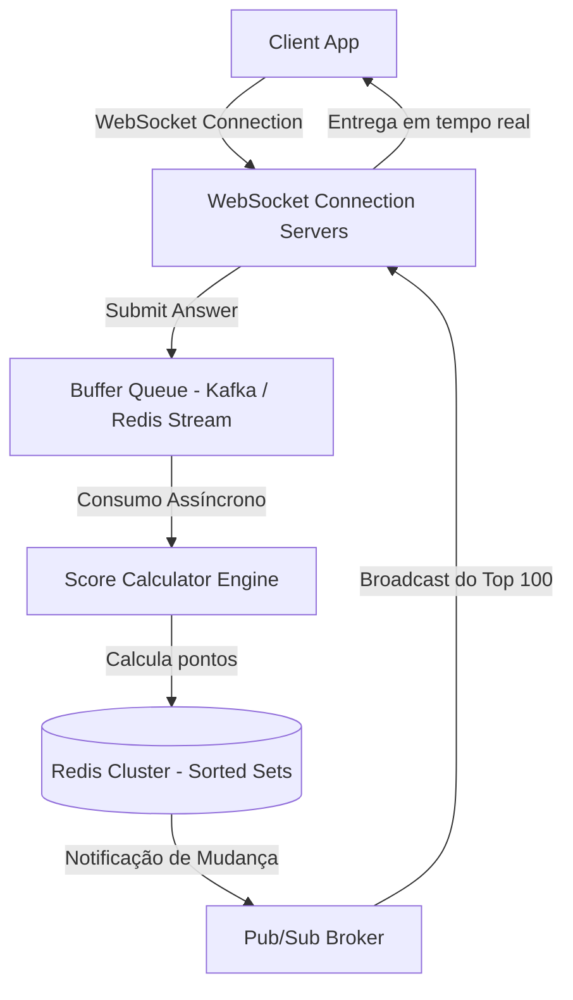

# 🏛️ Etapa 3: System Design Onsite - Placar em Tempo Real e Ingestão de Respostas

* **Responsável:** Alex (Staff Engineer) & Principal Engineer
* **Duração Recomendada:** 60 minutos
* **Foco:** Arquitetura de tempo real de altíssima concorrência, processamento in-memory de alta frequência, escalabilidade de conexões WebSocket persistentes e broadcast em larga escala.

---

## 🎯 O Enunciado do Desafio

O candidato deve projetar o backend de um **Sistema de Quiz ao Vivo e Leaderboard em Tempo Real** (similar ao Kahoot ou trivia show interativo). 

O sistema deve suportar transmissões ao vivo contendo **1 milhão de usuários simultâneos (CCU)** respondendo à mesma pergunta em uma janela restrita de 10 segundos.

### 📊 Requisitos e Escala de Big Tech

#### Requisitos Funcionais:
1. **Submeter Resposta**: Receber a resposta do usuário (ID da pergunta, alternativa escolhida, timestamp de envio).
2. **Cálculo de Pontos**: Computar os pontos com base na exatidão e velocidade da resposta (quanto mais rápido responder, mais pontos).
3. **Placar em Tempo Real (Leaderboard)**: Atualizar instantaneamente o ranking global e mostrar o Top 100 dos participantes em um painel central público e no celular dos jogadores.

#### Requisitos Não-Funcionais (Escala e Concorrência):
* **Escrita Concorrente Extrema**: Suportar rajada de **1.000.000 de requisições de resposta em menos de 10 segundos** (Média de 100k TPS na janela de atividade).
* **Latência de Rankeamento**: Atualização das posições e pontuações do ranking no banco/cache em menos de 50ms.
* **Vazão de Broadcast**: Disparar a atualização do Top 100 para todos os 1 milhão de usuários conectados em menos de 1.5 segundo após o encerramento da rodada.

---

## 🗺️ Guia de Expectativas para Avaliação (Nível Staff L6+)

O design deve ser dividido de forma robusta entre a **Ingestão Ágil com Amortecimento (Write Path)** e a **Distribuição com Broadcast (Read Path)** baseada em conexões persistentes WebSocket.

### 1. Ingestão Amortecida (Write-Path)
* **Expectativa Staff**: Processar 100k TPS de escritas transacionais síncronas diretamente em bancos de dados tradicionais é inviável e causará exaustão de conexões.
* **Solução Esperada**:
  * As conexões dos usuários repassam as respostas diretamente para um barramento de mensageria com alta taxa de vazão (ex.: **Kafka** ou **Redis Streams**) de forma não-bloqueante.
  * Workers em background leem as respostas, validam contra o gabarito e calculam a pontuação off-line de forma assíncrona, desonerando o endpoint HTTP/WebSocket principal.

### 2. Otimização do Leaderboard In-Memory (Redis Sorted Sets)
* **Expectativa Staff**: A estrutura clássica para leaderboards eficientes em produção é o **Redis Sorted Set (ZSET)**. No entanto, um único ZSET com 1 milhão de chaves concorrentes pode se tornar um gargalo de thread única (Redis opera em single-thread para comandos principais).
* **Solução Staff**:
  * Sharding do placar: Dividir os jogadores em múltiplos sub-rankings regionais ou lógicos (ex: `leaderboard_bucket_1`, `leaderboard_bucket_2`) e calcular as lideranças de forma distribuída (MapReduce).
  * Para o placar principal global (Top 100), manter uma chave unificada apenas com os top-performers de cada bucket, reduzindo a disputa concorrente na chave global.

### 3. Broadcast Otimizado para 1 Milhão de Conexões WebSocket
* **Expectativa Staff**: Disparar 1 milhão de payloads JSON independentes pela rede gerará um consumo de CPU insustentável no servidor e saturação dos links de rede (*network congestion*).
* **Solução**:
  * **Compactação de Payload**: Utilizar formatos binários eficientes (como **Protocol Buffers** ou FlatBuffers) em vez de JSON bruto.
  * **Agrupamento de Broadcast (Pub/Sub Sharding)**: Dividir as conexões entre múltiplos servidores físicos. O servidor central dispara uma única mensagem Pub/Sub contendo o Top 100 para os nós servidores de conexões. Cada nó de conexão replica localmente a mensagem para os seus WebSockets locais de forma paralela usando threads de kernel de forma eficiente.

---

## ⚖️ Rubrica de Avaliação (Sinais de Senioridade)

### 🟥 Sinais Vermelhos (Red Flags)
* Sugere rodar `UPDATE users SET score = score + N WHERE id = X` no banco MySQL a cada resposta concorrente e dar `SELECT` com `ORDER BY score DESC LIMIT 100` a cada segundo.
* Acredita que um único servidor Node.js consegue lidar com 1 milhão de WebSockets ativos e fazer broadcast em JSON puro sem otimizações de rede.
* Não planeja bufferização para conter as rajadas de tráfego de entrada.

### 🟨 Senior Engineer (L5)
* Propõe uso de Redis Sorted Sets para manter o ranking atualizado em $O(\log N)$.
* Utiliza um message queue intermediário para desacoplar as respostas do cálculo.
* Consegue dimensionar um cluster básico de servidores WebSocket com base em balanceadores de carga com persistência de sessão.

### 🟩 Staff Engineer (L6+)
* Identifica gargalos de single-thread no Redis em chaves quentes (Hot ZSETs) e propõe sharding lógico de buckets de ranking.
* Detalha otimizações a nível de sistema operacional e de rede (protocolo binário, ajuste de FDs, pooling de conexões) para suportar 1M CCU.
* Propõe estratégias de controle de fluxo contra *Thundering Herd* nas reconexões de WebSockets após quedas parciais de rede móvel (Jitter de reconexão e exponential backoff no cliente).
