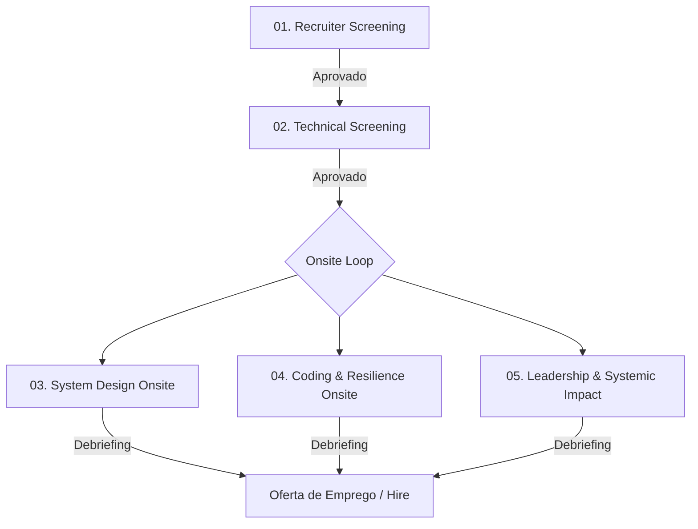

# 🎯 Staff Engineer Recruitment Pipeline: Real-Time Leaderboard & Gamification

Seja bem-vindo ao repositório de simulação de contratação para a posição de **Staff Software Engineer** no time de **Gaming, Real-Time Platforms & Gamification** da nossa Big Tech.

Este espaço foi estruturado em cooperação direta entre o time de **Tech Recruiting** e a guilda de **Staff+ Engineers** para a avaliação técnica e de liderança prática em sistemas de altíssimo volume de escrita concorrente, persistência em memória e conexões persistentes WebSocket/SSE de grande escala.

---

## 👥 As Personas do Processo

O processo é desenhado e avaliado sob duas perspectivas complementares:

### 💼 A Recrutadora Técnica (Gaby)
* **Foco:** Fit de liderança, mediação de conflitos técnicos profundos, comunicação de decisões técnicas baseadas em restrições financeiras e desenvolvimento de talentos no time.
* **Critério de Sucesso:** Identificar se o candidato consegue engajar e inspirar o time a focar em soluções simples e performáticas em vez de arquiteturas super-dimensionadas de alto custo.

### 🛠️ O Staff Engineer (Alex)
* **Foco:** Estruturas de dados avançadas concorrentes (SkipLists, Trees), locks de granularidade fina, concorrência lock-free, gerenciamento de conexões persistentes WebSocket (1M+ CCU) e trade-offs de banco de dados SQL vs NoSQL em memória.
* **Critério de Sucesso:** Avaliar se o candidato compreende a física de concorrência a nível de CPU e memória e sabe desenhar arquiteturas de baixíssima latência sob fluxos de escrita extremos.

---

## 🗺️ O Pipeline de Contratação (End-to-End)

O processo é dividido em **5 etapas consecutivas**. Cada etapa possui um guia dedicado contendo as perguntas do entrevistador, os requisitos, o desafio prático (se aplicável) e as rubricas de avaliação detalhadas.

### 🔗 Navegação pelas Etapas

1. **[Etapa 1: Recruiter Phone Screen](./01-recruiter-screening.md)**
   * *Foco:* Trajetória comportamental, mentoria técnica e resiliência em grandes incidentes ao vivo.
2. **[Etapa 2: Technical Screening](./02-technical-screening.md)**
   * *Foco:* Noções de concorrência com threads, multiplexação de portas TCP, locks e SkipLists vs B-Trees.
3. **[Etapa 3: System Design Onsite](./03-system-design-onsite.md)**
   * *Foco:* Projeto de arquitetura ponta a ponta: *Motor de Leaderboard Global e Ingestão de Respostas em Tempo Real (Kahoot-Scale)*.
4. **[Etapa 4: Coding & Resilience Onsite](./04-coding-skiplist-onsite.md)**
   * *Foco:* Desafio de código prático: *Implementação de uma SkipList Concorrente Lock-Free*.
5. **[Etapa 5: Leadership & Systemic Impact Onsite](./05-leadership-systemic-impact.md)**
   * *Foco:* Resolução de debates sobre uso de bancos relacionais tradicionais sob concorrência agressiva de escrita e mitigação de picos instantâneos de tráfego.

---

> [!IMPORTANT]
> **Expectativa para Nível Staff (L6+)**:
> O candidato deve demonstrar que gerenciar placares dinâmicos para milhões de jogadores simultâneos não se resume a atualizar uma linha em um banco SQL. Espera-se que ele apresente conhecimento profundo de estruturas em memória de alta performance, gerenciamento de conexões abertas WebSocket e controle de contenção de locks de escrita.
