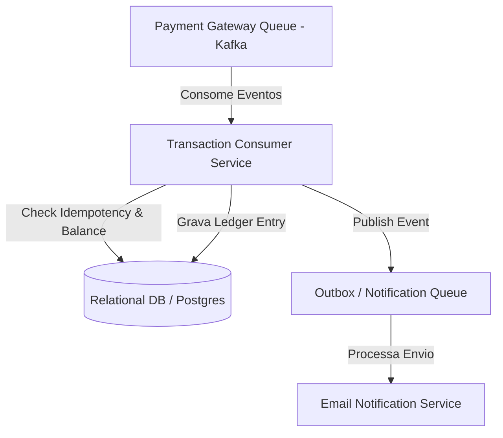

# 🏛️ Tech Lead - Trilha 1 - Etapa 3: System Design - Event-Driven Ledger

* **Responsável:** Staff Engineer & Principal Engineer
* **Duração:** 60 minutos
* **Foco:** Arquiteturas orientadas a eventos (EDA), idempotência no consumidor, tratamento de falhas de filas e observabilidade de time.

---

## 🎯 O Enunciado do Desafio

Projete um **Sistema de Processamento de Transações Financeiras e Ledger** baseado em eventos para o time de pagamentos. O sistema recebe notificações de cobranças aprovadas vindas de uma fila (Kafka/RabbitMQ), atualiza o saldo dos usuários e envia e-mails de confirmação.

* **Throughput:** Pico de **1.000 mensagens por segundo**.
* **Consistência:** Garantir consistência local e que nenhuma transação seja reprocessada em duplicidade caso a fila envie a mesma mensagem duas vezes (garantia de entrega *at-least-once*).

---

## 🗺️ Guia de Expectativas para Avaliação (Nível Tech Lead)

### 1. Consumo Seguro e Idempotência
* **Foco Tech Lead:** O candidato deve propor uma validação de idempotência forte no consumidor de banco de dados (ex.: tabela de `processed_messages` onde a chave primária é o ID da mensagem do Kafka) para garantir que uma mensagem duplicada não seja reprocessada.

### 2. Tratamento de Erros e DLQ (Dead Letter Queue)
* **Desafio:** O que fazer se uma mensagem vier corrompida ou o saldo do usuário for inválido?
* **Solução Tech Lead:** O candidato deve desenhar um fluxo com **Dead Letter Queue (DLQ)**. Mensagens com falhas não-recuperáveis (como payload corrompido) devem ser enviadas para a DLQ para análise manual/scripts de correção, evitando travar a fila principal do time.

### 3. Observabilidade e Telemetria
* **Foco Tech Lead:** O candidato deve incluir o rastreamento distribuído (Distributed Tracing com OpenTelemetry) usando chaves de correlação (Correlation IDs) que cruzam desde a chegada do evento no Kafka até a gravação no banco e o disparo do e-mail. Isso é vital para o suporte operacional da equipe.

---

## ⚖️ Rubrica de Avaliação (Tech Lead)
* **Sinal Verde (Green Flag):** Propõe idempotência no consumidor de forma atômica dentro de transações de banco; desenha uma estratégia robusta de DLQ e monitoramento de erros de consumo; foca na manutenibilidade da ferramenta pela equipe técnica.
* **Sinal Vermelho (Red Flag):** Ignora a possibilidade de eventos duplicados na fila; não sabe explicar como funciona um fluxo de DLQ.

---

[Ir para a Etapa 4: Coding Onsite ➡️](./04-coding-onsite.md)
