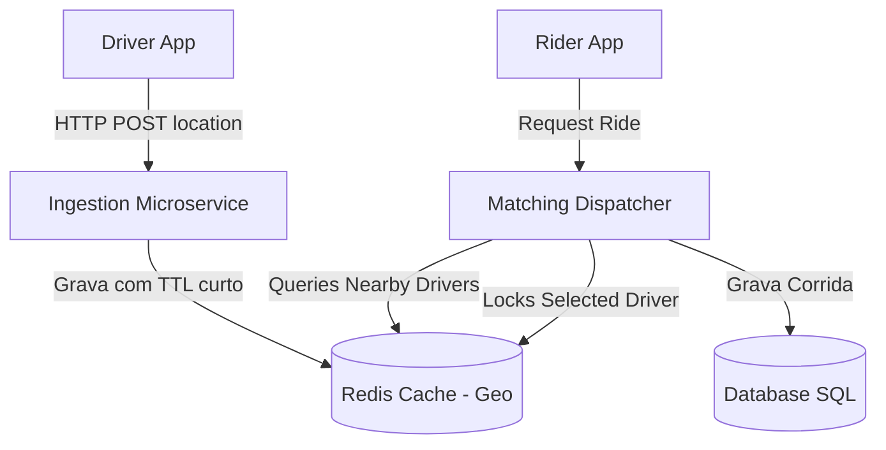

# 🏛️ Tech Lead - Trilha 2 - Etapa 3: System Design - Ride-Sharing Dispatcher

* **Responsável:** Staff Engineer & Principal Engineer
* **Duração:** 60 minutos
* **Foco:** Arquitetura de microsserviços do time, caching distribuído de estado geoespacial, tratamento de picos de carga locais e observabilidade.

---

## 🎯 O Enunciado do Desafio

Projete a arquitetura do **Serviço de Despacho (Dispatcher)** para parear motoristas e passageiros ativos em uma mesma cidade em tempo real. O sistema deve cobrir a ingestão de coordenadas dos carros (10.000 motoristas ativos na cidade) e processar as solicitações de corridas dos usuários.

* **Throughput:** ~2.000 atualizações de localização por segundo.
* **Escala do Time:** O design deve ser modular para que a equipe possa desenvolver novas regras de pareamento (ex.: corridas corporativas, motoristas parceiros) de forma desacoplada.

---

## 🗺️ Guia de Expectativas para Avaliação (Nível Tech Lead)

### 1. Modelagem do Estado de Geolocalização (Memória vs. Disco)
* **Foco Tech Lead:** O candidato deve separar dados voláteis (localização atual do carro, que muda a cada segundos) de dados transacionais (histórico de corridas finalizadas). A localização deve ser mantida em memória (ex.: Redis com indexação geográfica GEOADD) para evitar sobrecarregar o banco de dados principal do time.

### 2. Tratamento de Concorrência Clássico (Double-Booking)
* **Desafio:** Como garantir que dois passageiros próximos não recebam a oferta de pareamento do mesmo motorista simultaneamente?
* **Solução Tech Lead:**
  * Uso de travas/locks de curta duração (ex.: no Redis ou usando update condicional com status `available` no banco) no registro do motorista quando ele é selecionado para uma oferta de corrida.

### 3. Observabilidade e Monitoramento Operacional do Time
* **Foco Tech Lead:** Propor painéis de telemetria contendo: taxa de sucesso de pareamento, latência de busca de motoristas, e alertas de inatividade (ex.: se o Redis parar de receber pings GPS). Isso garante a saúde do sistema sob responsabilidade do time.

---

## ⚖️ Rubrica de Avaliação (Tech Lead)
* **Sinal Verde (Green Flag):** Separa estado volátil de persistente; propõe mecanismos de lock atômicos funcionais e fáceis de monitorar; desenha logs estruturados claros para diagnóstico de falhas em produção.
* **Sinal Vermelho (Red Flag):** Tenta resolver todo o problema usando joins complexos em banco relacional a cada segundo.

---

[Ir para a Etapa 4: Coding Onsite ➡️](./04-coding-onsite.md)
