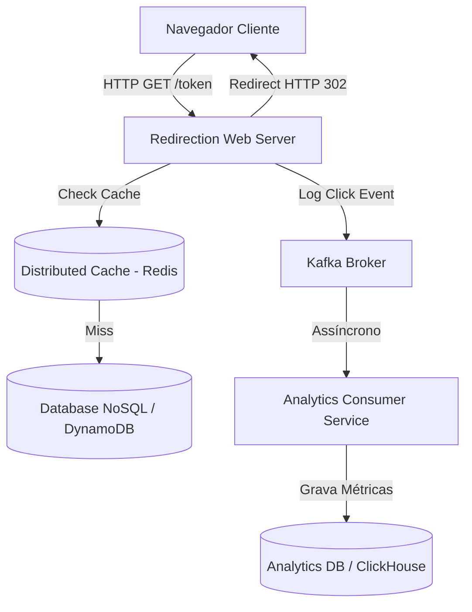

# 🏛️ Tech Lead - Trilha 3 - Etapa 3: System Design - Scale URL Shortener

* **Responsável:** Staff Engineer & Principal Engineer
* **Duração:** 60 minutos
* **Foco:** Caching distribuído de alta concorrência, desacoplamento de leitura/escrita e pipelines assíncronos de coleta de dados analíticos.

---

## 🎯 O Enunciado do Desafio

Projete a arquitetura de um **Encurtador de URLs e Plataforma de Rastreamento de Métricas** para suportar campanhas de marketing massivas do time de Growth.

### 📊 Requisitos e Escala do Time
* **Volume:** Suportar **10.000 requisições de leitura por segundo (QPS)** nos links curtos.
* **Escrita:** Suportar **100 criações por segundo**.
* **Coleta de Analytics:** Rastrear cliques (IP, Referer, Timestamp) de forma assíncrona sem impactar os 15ms de latência do redirecionamento do usuário.

---

## 🗺️ Guia de Expectativas para Avaliação (Nível Tech Lead)

### 1. Desacoplamento da Gravação Analítica (Escrita Assíncrona)
* **Foco Tech Lead:** O candidato deve propor o desacoplamento imediato da gravação do log de cliques. Em vez de salvar no banco relacional ou NoSQL de forma síncrona durante o redirecionamento, o servidor deve disparar um evento assíncrono para o Kafka e responder o HTTP 302 imediatamente.

### 2. Estratégia de Caching Distribuído (Redis)
* **Foco Tech Lead:** Propor caching do par `token -> long_url` no Redis com tempo de expiração (TTL) longo (ex.: 24h ou mais). Explicar a política de invalidação simples de cache caso a URL seja atualizada pelo usuário.

### 3. Slicing e Planejamento para o Time de Desenvolvimento
* **Foco Tech Lead:** Como o candidato divide o projeto para a equipe implementar (ex.: Sprint 1 - Core URL Shortening e persistência NoSQL; Sprint 2 - Cache Redis e redirecionamento rápido; Sprint 3 - Pipeline assíncrono de Analytics).

---

## ⚖️ Rubrica de Avaliação (Tech Lead)
* **Sinal Verde (Green Flag):** Propõe processamento assíncrono de logs; modela estratégias funcionais de cache; demonstra visão prática de como dividir o escopo do projeto em tarefas estimadas para a equipe.
* **Sinal Vermelho (Red Flag):** Tenta fazer gravação síncrona de analytics no banco operacional durante o redirecionamento, travando o tempo de resposta do cliente.

---

[Ir para a Etapa 4: Coding Onsite ➡️](./04-coding-onsite.md)
